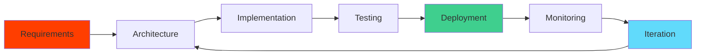

# 🐾 Nine Lives Development

### _High-Performance Web Engineering, SEO, and AI Automation_

**Building modern web systems that perform, rank, and scale.**

_Featured partner of the Wen Coin Foundation for web engineering and automation._

---

## 🎯 Who We Are

Nine Lives Development is a **high-performance engineering studio** specializing in **web applications**, **SEO-first architecture**, and **AI-powered automation systems**.

We work with teams who need more than a website — teams who need **products that rank, convert, and scale cleanly**.

**Small. Senior. Fast.** No bloated PM structures. You work directly with the engineers shipping your product.

> [!NOTE]
> We build fast, but we design for longevity. We prefer boring tech that scales. We optimize for clarity over cleverness.

---

## 🚀 Core Offerings

<h3>💻 Web Engineering (Core Offering)</h3>

High-performance web applications built **SvelteKit-first** (React when required). Every project is architected for speed, SEO, and long-term maintainability.

-   **Server-side rendering**, edge functions, and SEO-safe routing
-   **Component-driven architecture** with reusable, documented UI blocks
-   **Tailwind-based design systems** with strict consistency
-   **Accessibility and semantic HTML** as default, not an afterthought
-   Performance budgets tied to **Lighthouse** and **Core Web Vitals**

<h3>🔍 SEO-First Architecture (Not Just Meta Tags)</h3>

We don't add SEO as an afterthought. We build SEO into the foundation — from routing to content generation to performance optimization.

-   **Programmatic sitemaps** and robots control
-   **Dynamic page generation** for local and vertical SEO
-   **Structured data (JSON-LD)** baked into page templates
-   **Canonicalization** and duplicate-content prevention
-   **Performance optimization** tied directly to search rankings

<h3>🤖 AI-Powered Optimization & Automation</h3>

Custom AI systems that eliminate manual work and accelerate workflows — from content generation to lead qualification to internal tooling.

-   **AI agents** for content generation, QA, and internal processes
-   **Prompt-driven systems** with versioned, tested prompts
-   **AI-assisted lead qualification** and routing
-   **AI summaries** for analytics, PRs, and activity logs
-   **RAG-based assistants** for internal docs and client knowledge bases

<h3>📊 Analytics, Tracking, and Data Pipelines</h3>

Event-driven tracking architecture designed for real insights, not vanity metrics. Privacy-aware, conversion-focused, and built to inform decisions.

-   **GA4, GTM, Search Console** integrations
-   **Event-driven tracking** (not pageview spam)
-   **Form, call, and conversion pipelines** with attribution
-   **Data normalization** for dashboards and reporting
-   **Privacy-aware tracking** with explicit consent handling

<h3>🏗️ Backend & Infrastructure</h3>

Modern backend systems built on **Firebase** and **Supabase** with secure authentication, role-based access, and environment-aware deployments.

-   **Firebase and Supabase** as primary backends
-   **Cloud Functions** for automation and orchestration
-   **Webhooks and background jobs** via n8n
-   **Secure role-based access** patterns
-   **Environment-aware deployments** (dev, staging, prod)

<h3>⚙️ Business Automation</h3>

Zero-touch operations systems that route leads, sync data, send notifications, and eliminate manual busywork.

-   **Lead ingestion and routing** systems
-   **CRM integrations** and sync logic (Salesforce, HubSpot, etc.)
-   **Notification pipelines** (Telegram, Slack, email)
-   **Scheduled reporting** and client updates
-   **Zero-touch operations** wherever possible

<h3>⛓️ Web3 & Experimental Builds (Selective)</h3>

We build Web3 tooling when it makes sense — community dashboards, token utilities, and meme-driven (but technically sound) experiments.

-   **Solana-based frontend integrations**
-   **Wallet connections** and token-gated experiences
-   **Community tooling** and dashboards
-   **Meme-driven but technically sound** builds
-   Clear separation of **experimental vs production-critical** systems

---

## 🏗️ Engineering Principles

### Our Core Philosophy

1. **Build fast, but design for longevity**
2. **Prefer boring tech that scales**
3. **Optimize for clarity over cleverness**
4. **Every repo should explain why it exists**
5. **Automation over manual process, always**

> [!IMPORTANT]
>
> ### What Nine Lives Is Not
>
> -   ❌ No WordPress theme flipping
> -   ❌ No SEO snake oil
> -   ❌ No black-box AI magic
> -   ❌ No overengineering for ego
> -   ❌ No shipping without intent

---

## 🤝 Trusted Partners

Nine Lives has partnered with leading organizations across fintech, healthcare, home services, real estate, and Web3.

<table>
<tr>
<td width="33%" align="center">

### 🌐 Web3 & Technology

**Wen Coin Foundation**
_Featured Partner_

**Cloak DAO**
_Treasury & Analytics_

**Ovols**
_Platform Engineering_

</td>
<td width="33%" align="center">

### 🏢 Consulting & Enterprise

**Stratella Consulting Group**
_Enterprise Solutions_

**Shoreline Group**
_Strategic Systems_

**Reliable Marketing Group**
_Growth Infrastructure_

</td>
<td width="33%" align="center">

### 🏗️ Construction & Home Services

**Palm Partners**
_Automation & Integrations_

**Palm Build**
_Internal Systems_

**Full Service Pros**
_Premium Remodeling_

</td>
</tr>
<tr>
<td width="33%" align="center">

### 🔧 Field Services

**Local Plumber Today**
_Lead Routing & Booking_

**HVAC Services Today**
_Service Automation_

**Slowinski Services**
_Operations Systems_

</td>
<td width="33%" align="center">

### 🏥 Healthcare

**Footprints Pediatrics**
_Patient Systems_

**Health Insurance Today**
_Lead & Quote Systems_

**Senior Medicare Renewal**
_Enrollment Automation_

**Integra PCS**
_Healthcare Technology_

</td>
<td width="33%" align="center">

### 🏘️ Real Estate & Lifestyle

**FJZ Apartments**
_Property Management_

**Turan Tattoo**
_Booking & Brand Systems_

**Get In The Gym**
_Fitness Platform_

</td>
</tr>
</table>

_...and more. We keep some client work confidential unless authorized._

---

## ⚙️ Technical Stack

<b>📦 View Full Technical Stack</b>

 

<table>
<tr>
<td width="33%" valign="top">

**Frontend (Core)**

-   SvelteKit 5
-   React / Next.js
-   Tailwind v4
-   GSAP
-   Lottie

</td>
<td width="33%" valign="top">

**Backend & Infrastructure**

-   Supabase
-   Firebase
-   Express
-   Cloud Functions
-   Node.js

</td>
<td width="33%" valign="top">

**SEO & Analytics**

-   GA4 / GTM
-   Search Console
-   Structured Data (JSON-LD)
-   Lighthouse CI
-   Sitemaps & Robots

</td>
</tr>
<tr>
<td width="33%" valign="top">

**AI & Automation**

-   OpenAI API
-   Embeddings & Vector Search
-   Custom Agents
-   n8n Workflows
-   Prompt Engineering

</td>
<td width="33%" valign="top">

**Integrations**

-   Slack / Telegram Bots
-   Twilio
-   Retreaver
-   Google Cloud
-   CRM Systems

</td>
<td width="33%" valign="top">

**Mobile & Web3**

-   SwiftUI 6+
-   Kotlin
-   Solana (Helius/Jupiter)
-   Ethereum (ethers/web3.py)
-   Privy / Turnkey

</td>
</tr>
</table>

---

## 🛠️ Repo Standards

> [!TIP]
> Every Nine Lives repository follows clear standards that signal seriousness and maintainability:

-   ✅ **Clear README** with purpose, stack, and status
-   ✅ **Environment setup documented**
-   ✅ **Consistent folder and naming conventions**
-   ✅ **Explicit "production vs experimental" labeling**
-   ✅ **No abandoned half-ideas without context**

---

## 💭 Philosophy

> _Nine Lives was named after Hunter — a reminder to build with care, loyalty, and craftsmanship._

The products we ship reflect that standard. Every line of code, every interface, every user interaction is crafted with intention and built to last.

We don't chase trends. We don't overengineer for ego. We build systems that work, that rank, and that our partners trust.

---

## 📬 Get In Touch

Ready to build something that performs? We'd love to hear about your project.

### 📧 [contact@ninelives.dev](mailto:contact@ninelives.dev)

### 🌐 [NineLives.dev](https://NineLives.dev)

---

_Building the future, one product at a time._ 🐾

